# RCNN

In this project I implemented MaskRCNN, an algorithm that addresses the task of instance seg-
mentation, which combines object detection and semantic segmentation into a per-pixel object detection framework. We train the Network on the standard COCO dataset, which has 80 object classes.

### Network Architecture
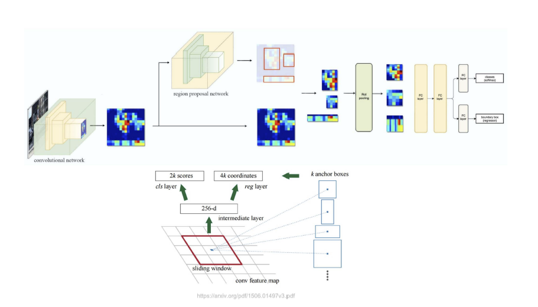
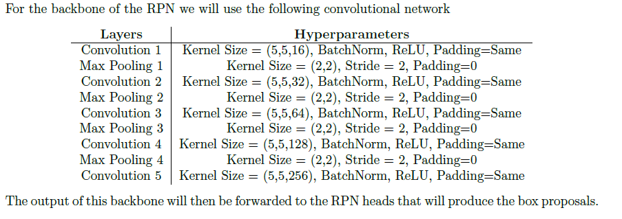
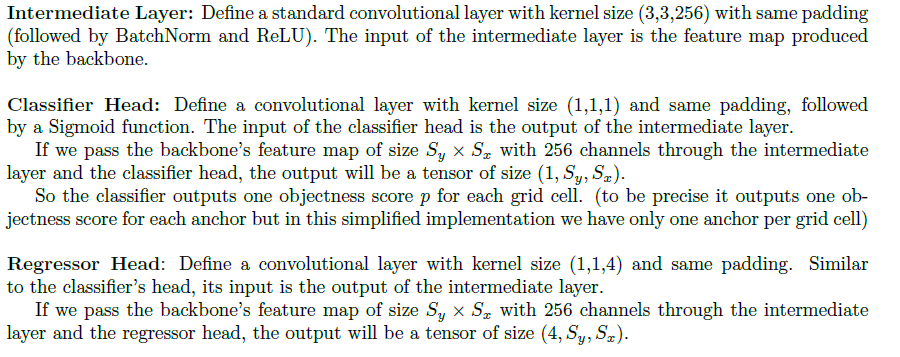

### Loss Objective
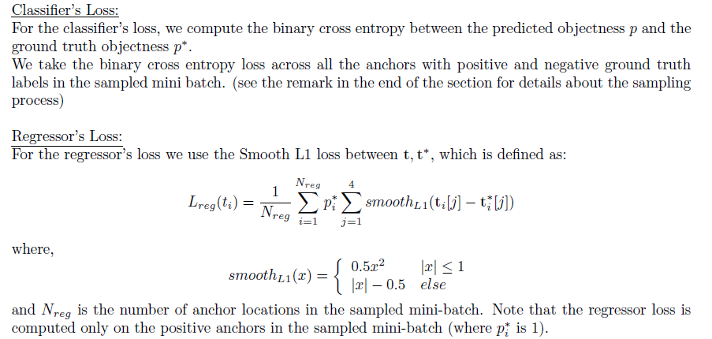

### Ground Truth and Outputs From Region Proposal Network
Region Proposal Networks (RPNs) are "attention mechanisms" for the object detection task, performing a crude but inexpensive first estimation of where the bounding boxes of the objects should be. 

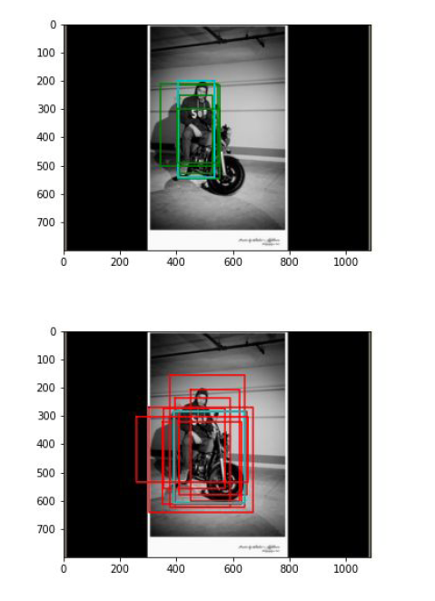
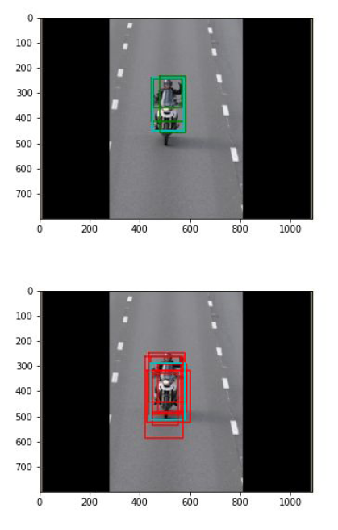

### Output From Network Before Post-Processing
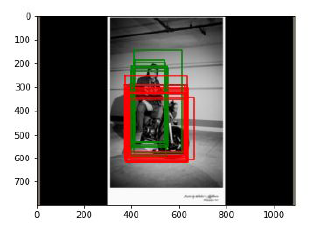
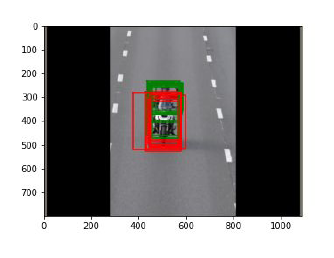

### After Post-Processing

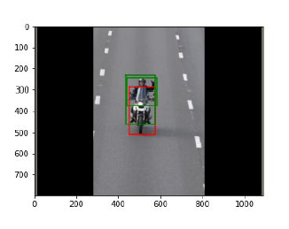

### Loss Plots
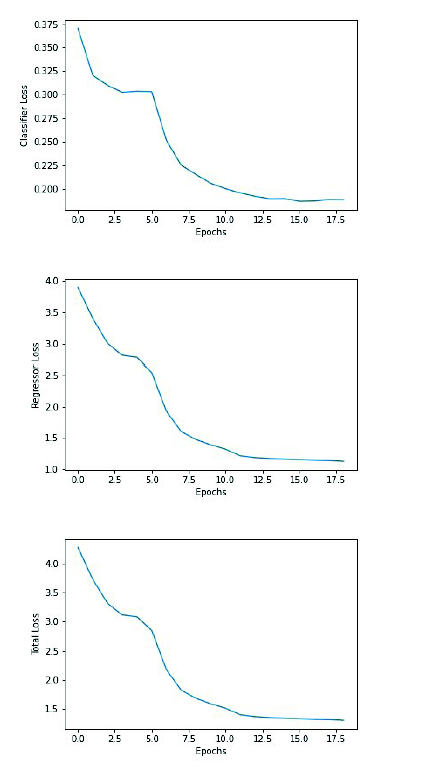

### MAP
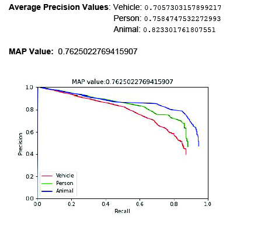

